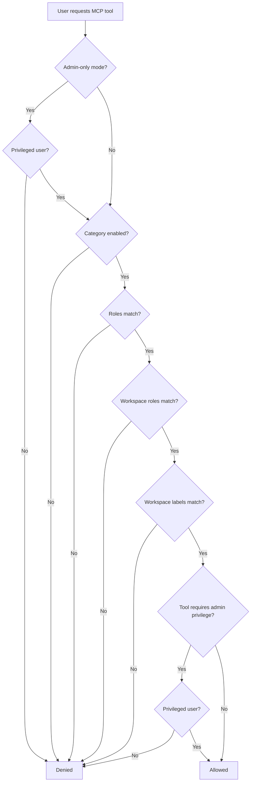

# Permitted MCP Tools

The **Tools** section of [MCP Configuration](./configuration.md) controls which tool categories are exposed on your tenant MCP server and who can use them. Each row is a **category** (for example `blueprints`), not an individual MCP tool name — all registered tools in that category inherit the same exposure settings.

::: tip Default posture
Every category ships **disabled** with empty role filters. Enable categories deliberately and scope them by role before connecting clients. Pair with **admin-only access** until you understand what each user needs.
:::

## Open the tools table

1. Go to **Privileged Home → MCP Configuration**.
2. Scroll to the **Tools** panel (**Exposed MCP tools**).
3. For each category row, set **Enabled**, **Roles**, **Workspace roles**, and **Workspace labels** as needed.
4. Click **Save**.

The table lists twelve categories. The **Tool** column shows the admin label and the category ID (for example `blueprints`).

## Per-category controls

| Column | Field | Behavior |
|--------|-------|----------|
| **Enabled** | `enabled` | When off, no tools in this category are available to any user, regardless of role. |
| **Roles** | `roles` | Tenant-level roles allowed to use tools in this category. Select **All roles** (`*`) or specific roles (for example `admin`, `editor`). **Empty** means no role restriction — any authenticated user who passes other checks can use the category. |
| **Workspace roles** | `wsRoles` | Workspace membership roles required when the user acts in a workspace context. Use **All workspace roles** (`*`) or specific values. **Empty** means no workspace-role restriction. |
| **Workspace labels** | `wsLabels` | User's active workspace must carry at least one of these labels. **Empty** means no label restriction. When a label is set, the user must match at least one listed label. |

### Workspace columns when workspaces are inactive

**Workspace roles** and **Workspace labels** are disabled in the admin form when workspace configuration is not active (`workspace-configuration.isActive` is `false`). In that mode, only **Enabled** and **Roles** apply.

When you later enable workspaces, configure workspace scoping before opening MCP to non-admin roles.

### Category ID vs individual tool names

Admin stores configuration by **category ID** (`blueprints`, `users`, `events`, …). The MCP server resolves each registered tool against its category:

1. Look for an `exposedTools` entry whose `toolId` matches the tool's own ID (for example `list-blueprints`).
2. If none, fall back to an entry whose `toolId` matches the tool's **category** (for example `blueprints`).

In practice, configure the category row — all tools in that category share the same enabled flag and role filters.

## How authorization works

When a connected client lists or calls tools, Qelos evaluates checks in order:

### Admin-only gate

When [admin-only access](./configuration.md#admin-only-access) is enabled, only **privileged** users can use MCP at all — users with the `admin` role or the privileged flag. Non-privileged users are blocked before any tool check runs.

### Category and role filters

For each tool, the server loads the category's `exposedTools` config and verifies:

- **`enabled`** is `true`
- **`roles`** — if non-empty, the user must have at least one listed role, or the list must include `*`
- **`wsRoles`** — same rule for workspace roles
- **`wsLabels`** — if non-empty, the user's workspace must include at least one listed label

### Admin-privileged tools

Some registered tools require **admin privilege** in addition to passing category filters (`requiredPrivilege: 'admin'`). Even if the category is enabled for a non-admin role, these tools remain unavailable unless the connecting user is privileged.

Tools marked **Admin only** in the table below always require a privileged user, regardless of role filters on the category row.

## Tool categories

The admin table defines twelve categories. The **Registered tools** column lists MCP tools currently in the server registry for that category.

| Category ID | Admin label | Description | Registered tools |
|-------------|-------------|-------------|------------------|
| `blueprints` | Blueprints | List and query blueprint data models | `list-blueprints`, `get-blueprint-entities`, `create-blueprint-entity` |
| `users` | Users | Manage tenant users and profiles | `list-users` (**Admin only**) |
| `configurations` | Configurations | Read and update tenant configurations | `get-app-config`, `list-configurations` (**Admin only**) |
| `workspaces` | Workspaces | Manage workspaces, members, and labels | `list-workspaces` |
| `events` | Events | List, emit, and subscribe to application events | `list-events` (**Admin only**) |
| `plugins` | Plugins | Manage installed plugins and micro-frontends | — |
| `agents` | AI agents | Chat with and configure AI agents | — |
| `integrations` | Integrations | Manage integration sources and workflows | `list-integration-sources` (**Admin only**) |
| `secrets` | Secrets | Access the secrets vault | — |
| `permissions` | Permissions | Check and manage user permissions | — |
| `content` | Content | Manage drafts and published content | — |
| `storage` | Storage | Manage storage buckets and uploaded assets | — |

Categories without registered tools appear in the admin table so you can pre-configure exposure before new tools ship. Enabling those rows has no effect until tools are added to the registry.

### Blueprints (`blueprints`)

Expose data-model operations to AI clients:

| Tool | What it does |
|------|--------------|
| `list-blueprints` | List blueprint definitions for the tenant |
| `get-blueprint-entities` | List entities for a blueprint (supports `limit`, `skip`, `sort`) |
| `create-blueprint-entity` | Create a new entity in a blueprint |

All three use the standard user SDK path. See [Create Blueprints](/getting-started/create-blueprints) for blueprint concepts.

### Configurations (`configurations`)

| Tool | What it does | Privilege |
|------|--------------|-----------|
| `get-app-config` | Fetch tenant app configuration metadata | User |
| `list-configurations` | List tenant configuration documents | Admin |

### Workspaces (`workspaces`)

| Tool | What it does |
|------|--------------|
| `list-workspaces` | List workspaces available to the authenticated user |

Use **Workspace roles** and **Workspace labels** on this category (and others) to limit exposure when workspaces are active.

### Users, events, integrations

These categories expose admin-only registry tools:

| Category | Tool | What it does |
|----------|------|--------------|
| `users` | `list-users` | List tenant users (optional `username`, `roles` filters) |
| `events` | `list-events` | List tenant events (supports pagination and filters) |
| `integrations` | `list-integration-sources` | List integration sources (optional `kind` filter) |

Privileged users still need the category **Enabled** and must pass role/workspace filters.

### Agents, plugins, content, storage, secrets, permissions

These categories are defined in the admin UI for future and extended tooling. No MCP tools are registered for them yet. Leave them disabled unless you are testing upcoming capabilities.

## Recommended starting configurations

Start minimal, verify client connectivity, then expand.

### Read-only administrator

Best first setup while learning MCP:

| Setting | Value |
|---------|-------|
| **Admin-only access** | Enabled |
| **blueprints** | Enabled, roles: `admin` |
| **configurations** | Enabled, roles: `admin` |

Connected admins can inspect blueprints and app configuration. `list-configurations` works because admins are privileged; `get-app-config` is available to any role that passes filters, but admin-only mode limits who can connect.

Example prompts once connected: *"List all blueprints"* or *"What is the current app configuration?"*

### Broader team — blueprint read access

When you disable admin-only and want editors to query data without admin tools:

| Setting | Value |
|---------|-------|
| **Admin-only access** | Disabled |
| **blueprints** | Enabled, roles: `editor`, wsRoles: `member` (adjust to your workspace roles) |

Editors can call `list-blueprints` and `get-blueprint-entities` but not `create-blueprint-entity` unless your [blueprint permissions](/auth/permissions-roles) allow entity creation through the SDK path. Keep **users**, **events**, and **integrations** disabled unless editors need them.

### Incident triage — events for admins

For operational debugging with admin users:

| Setting | Value |
|---------|-------|
| **Admin-only access** | Enabled |
| **events** | Enabled, roles: `admin` |
| **blueprints** | Enabled, roles: `admin` |

Admins can pull recent error events and cross-reference blueprint data. See [Examples & Ideas](./examples.md) for prompt patterns.

## Security notes

- **Enable admin-only first** — prevents non-admins from completing OAuth consent while you configure tools.
- **Enable the smallest set of categories** — each enabled category exposes every registered tool in that category to users who pass filters.
- **Avoid `*` on roles** unless every tenant role should access the category — prefer explicit roles such as `admin` or `editor`.
- **Admin-privileged tools** (`list-users`, `list-events`, etc.) still require a privileged connecting user even when role filters are broad.
- **Review after role changes** — if you add new tenant or workspace roles, revisit MCP tool rows to ensure exposure still matches intent.

## Related documentation

- [MCP Configuration](./configuration.md) — enable the server, callback URLs, admin-only mode
- [Clients](./clients.md) — connect Cursor, Claude, ChatGPT, Devin
- [Examples & Ideas](./examples.md) — prompts and workflows once tools are permitted
- [Permissions & Roles](/auth/permissions-roles) — tenant and workspace role model
- [AI Agents](/ai/agents) — agent configuration (future `agents` category tools)
